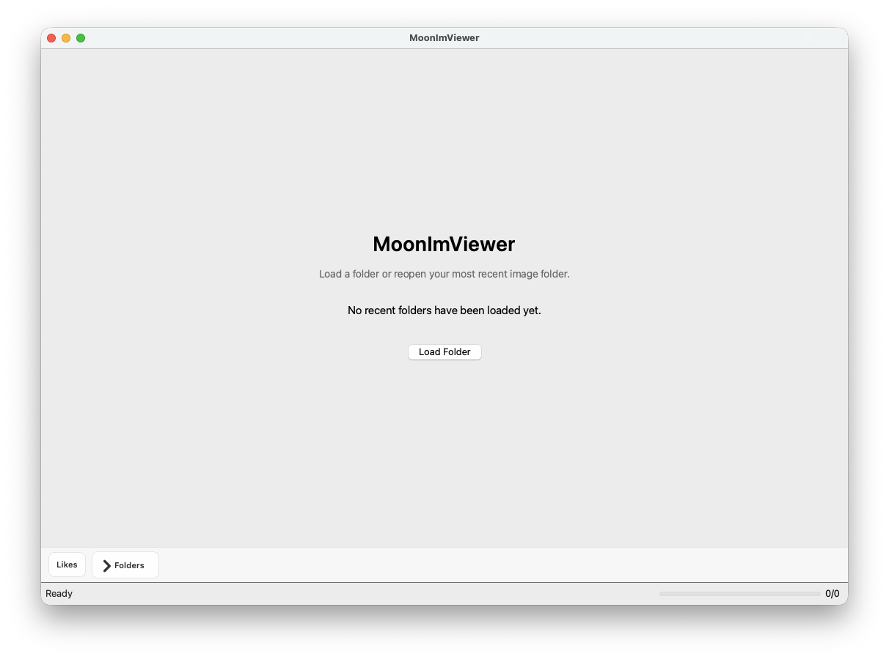
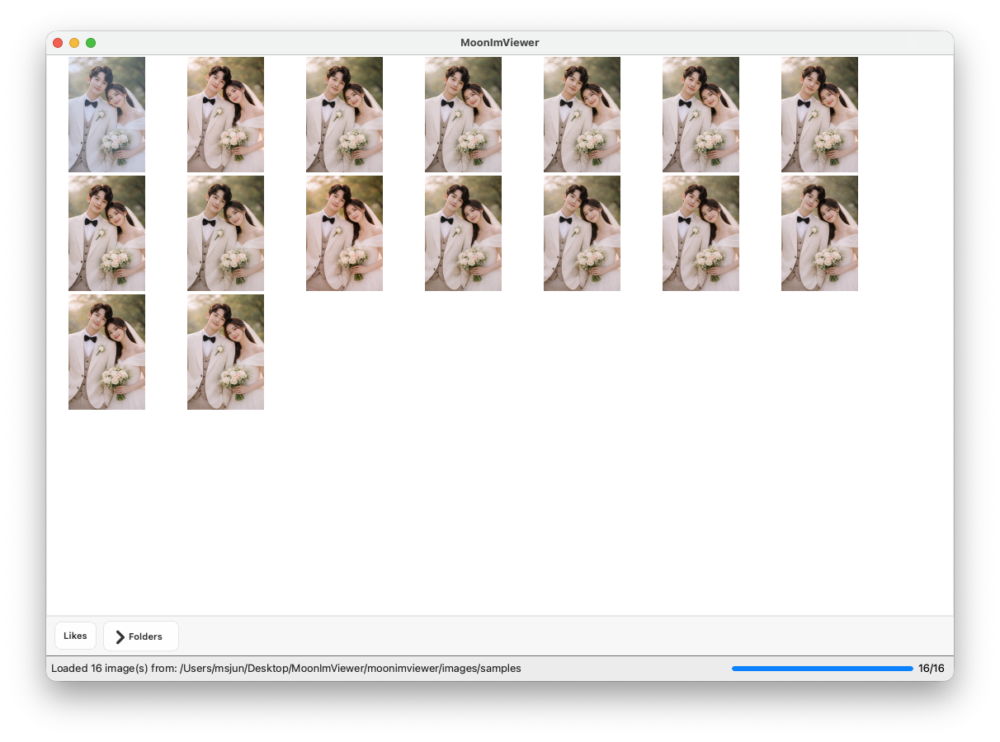

# MoonImViewer

[English](README.md) | 한국어 | [简体中文](README.zh-CN.md)

  

**MoonImViewer**는 **대량의 이미지 폴더**를 빠르게 훑어봐야 하는 사람들을 위한 데스크톱 이미지 뷰어입니다.

이미지를 하나씩 열어보는 대신, 직관적인 썸네일 그리드와 상세 보기, 그리고 즐겨찾기 기능들을 제공합니다.

  
  

**여러 개의 비슷한 이미지** 중 디테일을 확인하여 원하는 이미지를 고르세요.

  
  

## 시작하기

MoonImViewer를 사용하는 가장 쉬운 방법은 GitHub Releases에서 최신 빌드를 다운로드하는 것입니다.

- macOS: `MoonImViewer-xxx-macos.zip`
- Windows: `MoonImViewer-xxx-windows.zip`

### 첫 실행 권한 안내

#### macOS

1. `시스템 설정`을 엽니다.
2. `개인정보 보호 및 보안`으로 이동합니다.
3. 하단 근처에서 차단된 앱 메시지를 찾습니다.
4. `그래도 열기`를 누릅니다.

#### Windows

1. 다운로드한 앱 파일을 우클릭합니다.
2. `속성`을 선택합니다.
3. `일반` 탭에서 `차단 해제`가 보이면 활성화합니다.
4. `적용`을 누른 뒤 앱을 다시 실행합니다.

## 키보드 단축키

### 갤러리

- `Arrow keys`: 선택 이동
- `Space`: 선택한 이미지 열기

### 상세 보기

- `Q/q`: 상세 보기 닫기
- `Left` / `Right`: 이전 또는 다음 이미지
- `Enter`: 좋아요 또는 좋아요 해제
- `A/a` 또는 `Space`: 자동 슬라이드쇼 시작 또는 중지
- `Up` / `Down`: 슬라이드쇼 속도 변경
- `M/m`: 확대경 토글
- `Mouse wheel`: 확대/축소
- `Drag`: 이미지 이동
